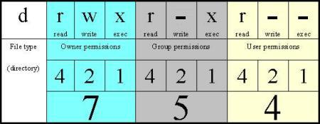

# 文件属性

## file: 查看文件的类型

    $ file /etc/sysctl.conf
    /etc/sysctl.conf: ASCII text

查看etc目录下都有哪些文件，分别有多少个

    $ file /etc/* | cut -b30- | sort | uniq -c | sort -nr
         59 directory
         42 ASCII text
          9 regular file, no read permission
          2 magic text file for file(1) cmd, ASCII text
          2 UTF-8 Unicode text
          2 POSIX shell script, ASCII text executable
          1 symbolic link to /proc/mounts
          1 symbolic link to ../usr/lib/os-release
          1 empty
          1 data
          1 broken symbolic link to /usr/share/zoneinfo/Etc/UTC

## stat

    $ stat /etc/sysctl.conf
      File: '/etc/sysctl.conf'
      Size: 2084        Blocks: 8          IO Block: 4096   regular file
    Device: fe01h/65025d    Inode: 2887935     Links: 1
    Access: (0644/-rw-r--r--)  Uid: (    0/    root)   Gid: (    0/    root)
    Access: 2015-09-06 05:30:20.000000000 +0000
    Modify: 2015-09-06 05:30:20.000000000 +0000
    Change: 2017-06-26 07:25:49.978327975 +0000
     Birth: -

Access这行在后面chown，chmod里会详细解释。

解释一下三个时间：

- Access：the last time the file was read
- Modify：the last time the file was modified (content)
- Change：the last time meta data of the file was changed (e.g. permissions)

## touch：更新stat时间

    $ touch a
    $ stat a
      File: 'a'
      Size: 0           Blocks: 0          IO Block: 4096   regular empty file
    Device: fe01h/65025d    Inode: 791193      Links: 1
    Access: (0644/-rw-r--r--)  Uid: ( 1000/   alice)   Gid: ( 1000/   alice)
    Access: 2017-06-27 11:13:54.629411947 +0000
    Modify: 2017-06-27 11:13:54.629411947 +0000
    Change: 2017-06-27 11:13:54.629411947 +0000
     Birth: -

更新为当前时间

    $ touch a
    $ stat a
      File: 'a'
      Size: 0           Blocks: 0          IO Block: 4096   regular empty file
    Device: fe01h/65025d    Inode: 791193      Links: 1
    Access: (0644/-rw-r--r--)  Uid: ( 1000/   alice)   Gid: ( 1000/   alice)
    Access: 2017-06-27 11:14:06.476236878 +0000
    Modify: 2017-06-27 11:14:06.476236878 +0000
    Change: 2017-06-27 11:14:06.476236878 +0000
     Birth: -

## chown

- alice用户的id为1000
- alice主组名也叫alice，组id也是1000
- alice还属于另一个名为sudo的组，组id是27

bob的信息类似，只是id不同

    $ id
    uid=1000(alice) gid=1000(alice) groups=1000(alice),27(sudo)
    $ id bob
    uid=1001(bob) gid=1001(bob) groups=1001(bob),27(sudo)

任何一个文件都有对应的所有者。默认情况下，用户创建文件的时候，文件的所有者就是这个用户本身，文件的组就是这个用户的主组。例如下面的a文件，在ls -l的时候，显示了两个alice，前一个是owner，后一个owner group。

    $ touch a
    $ ls -l a
    -rw-r--r-- 1 alice alice 0 Jun 27 11:21 a

把a文件的owner从alice修改成bob。这个操作本身alice是没有权限的（对应的bob也没有权限）。所以使用了sudo来执行，root有这个权限。

    $ sudo chown bob a
    $ ls -l a
    -rw-r--r-- 1 bob alice 0 Jun 27 11:21 a

修改文件组

    $ sudo chown bob:bob a
    $ ls -l a
    -rw-r--r-- 1 bob bob 0 Jun 27 11:21 a

递归修改目录和所有子目录里的所有文件`-R`

    $ sudo chown -R bob:bob dirx

etc目录下有三个文件，存放着所有用户的信息

    $ ls /etc/passwd /etc/shadow /etc/group
    /etc/group  /etc/passwd  /etc/shadow

- passwd列出所有用户公开的信息，例如登录名，shell，主组，uid，gid等，但并没有存放密码
- shadow存放着用户加密后的密码
- group列出所有组的信息

## chmod

有了文件所有权的信息。就可以来定义不同用户对这个文件的操作权限。ls -l最前面那行`-rw-r--r--`对应如下表格：

1. 总共分成四组。第一组1个字符，后三组分别3个字符。
2. 第一组：`-`代表普通文件；`d`代表目录
3. 后三组用来指示三类用户对这个文件的权限。分别是，owner，同组用户，其他用户
4. 后三组3个字符，分别代表read, write, exec三种权限；对应的某类用户有该权限就出现字母，没有就用`-`代表
5. rwx这个字母，如果看成3位的二进制数，每位只有两种情况，有权限或者没有权限。一共就有7中可能。rwx分别代表4,2,1；所以`rwxr-xr--`经常也用数字`754`来代表

两种形式来修改文件权限，第一种是指定全量

    $ ls -l a
    -rw-r--r-- 1 alice alice 0 Jun 27 11:47 a
    $ chmod 754 a
    $ ls -l a
    -rwxr-xr-- 1 alice alice 0 Jun 27 11:47 a*

第二种是增量，增加权限

    $ ls -l a
    -rw-r--r-- 1 alice alice 0 Jun 27 11:47 a
    $ chmod u+x,g+w a
    $ ls -l a
    -rwxrw-r-- 1 alice alice 0 Jun 27 11:47 a*

也可以减回去

    $ chmod u-x,g-w a
    $ ls -l a
    -rw-r--r-- 1 alice alice 0 Jun 27 11:47 a

## du：估算文件占磁盘的空间

    $ du -h /var/log/lastlog
    288K    /var/log/lastlog

单独文件的大小，通过stat, ls -l都可以显示。du更多的时候还是用在目录情况下，因为前两种方法不会计算目录中所包含文件的大小。

人可读的方式显示文件大小 *KMGT*

    alice@lb:/usr/lib/python3.5$ du -hd1
    368K    ./http
    304K    ./logging
    1.8M    ./idlelib
    660K    ./xml
    2.4M    ./lib-dynload
    784K    ./tkinter
    184K    ./html
    500K    ./multiprocessing
    168K    ./xmlrpc
    60K ./dbm
    248K    ./importlib
    140K    ./plat-x86_64-linux-gnu
    108K    ./json
    804K    ./asyncio
    420K    ./unittest
    1.4M    ./distutils
    788K    ./pydoc_data
    332K    ./test
    124K    ./concurrent
    76K ./venv
    32K ./sqlite3
    936K    ./lib2to3
    68K ./curses
    2.3M    ./encodings
    140K    ./wsgiref
    120K    ./collections
    284K    ./urllib
    804K    ./email
    92K ./ctypes
    4.0K    ./config-3.5m-x86_64-linux-gnu
    3.7M    ./__pycache__
    24M .

指定查看目录的深度`-d`

    alice@lb:/usr/lib/python3.5$ du -hd0
    24M .
