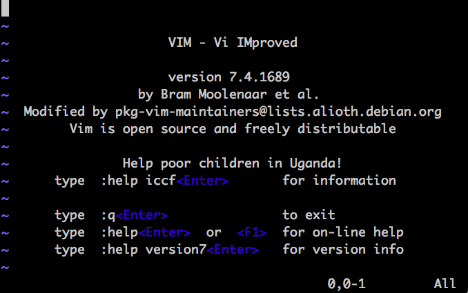
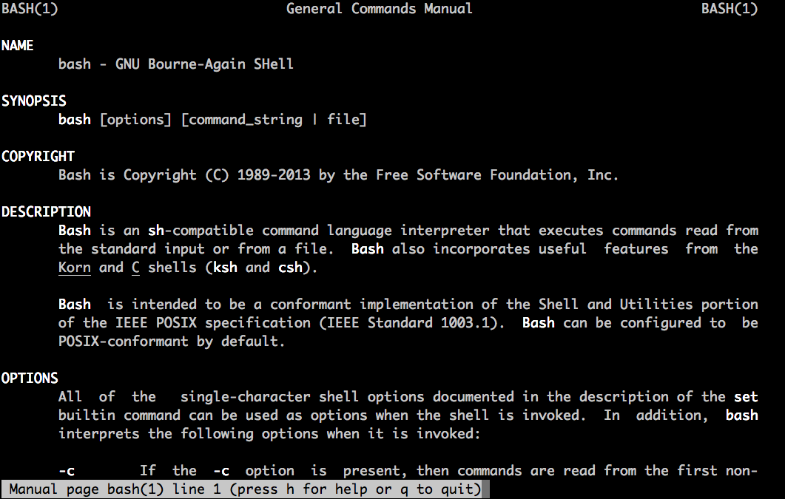

# Env

所有的例子都在ubuntu-16.04上给出。还有bash的版本。

    $ docker run --rm -h lb -ti lb /bin/bash
    alice@lb:~$ cat /etc/issue
    Ubuntu 16.04.2 LTS \n \l

    alice@lb:~$ bash --version
    GNU bash, version 4.3.48(1)-release (x86_64-pc-linux-gnu)
    Copyright (C) 2013 Free Software Foundation, Inc.
    License GPLv3+: GNU GPL version 3 or later <http://gnu.org/licenses/gpl.html>

    This is free software; you are free to change and redistribute it.
    There is NO WARRANTY, to the extent permitted by law.

命令前会有 `$` 或者 `#` 符号。分别代表普通用户，或者root用户。

除非需要root权限，后面的命令都使用`alice`用户来运行，这是我们为讲解而创建的默认用户。

    alice@lb:~$ id
    uid=1000(alice) gid=1000(alice) groups=1000(alice)
    alice@lb:~$ su -
    Password:
    root@lb:~# whoami
    root
    root@lb:~# id
    uid=0(root) gid=0(root) groups=0(root)

一般情况下，默认的当前目录都是/home/alice目录，这是alice的home目录，一般用 `~` 这个符号来表示home目录。

任何时候想要回到家目录，只需要执行不带参数的`cd`命令，或者`cd ~`，就可以回到home目录。

    alice@lb:~$ pwd
    /home/alice
    alice@lb:~$ cd /usr/lib/python2.7/dist-packages/
    alice@lb:/usr/lib/python2.7/dist-packages$ cd
    alice@lb:~$ pwd
    /home/alice

命令行之前的提示符叫做PS1（prompt string 1）。shell在每次等待我们的输入时，都会显示这个。

在我们的例子里它一直都会是`<user>@<host>:<dir>$`这种格式，关于如何定制修改它不在这里解释。

    alice@lb:~$ echo $PS1
    \[\e]0;\u@\h: \w\a\]${debian_chroot:+($debian_chroot)}\u@\h:\w\$

一般情况下，我们使用vim来编辑文件。

    alice@lb:~$ vim

输入`:q<Enter>`可以退出vim编辑器，回到shell提示符。
    
manual: man命令可以用来查看命令的手册。将会进入到一个交互式的界面。需要记住的几个按键有：

- q: 退出man
- h: 查看帮助
- j: 下一行
- k: 上一行
- f: 下一页
- b: 上一页

    alice@lb:~$ man bash

