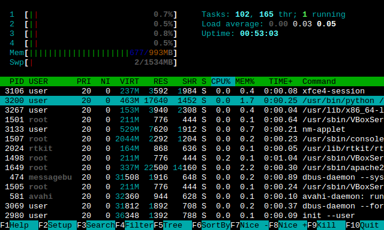

# 查看进程

## ps

    $ ps aux
    USER       PID %CPU %MEM    VSZ   RSS TTY      STAT START   TIME COMMAND
    alice        1  0.0  0.1  18468  3456 ?        Ss   03:45   0:05 /bin/bash
    alice     8609  0.0  0.1  34428  2828 ?        R+   14:52   0:00 ps aux

## uptime：系统从启动到现在多长时间

    $ uptime
     14:48:36 up 4 days, 15:19,  0 users,  load average: 0.00, 0.00, 0.00

## top && htop：系统当前的进程状况

## free：内存使用的情况

    $ free -h
                  total        used        free      shared  buff/cache   available
    Mem:           2.0G         82M        588M        154M        1.3G        1.5G
    Swap:          1.0G          0B        1.0G