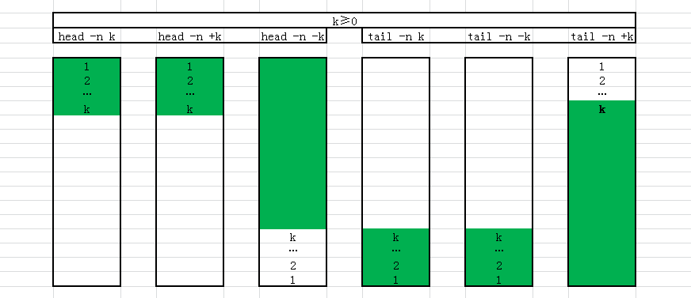
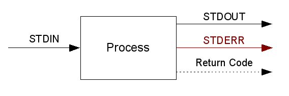

# 文件内容操作

## cat: 显示文件内容

    $ cat /etc/lsb-release
    DISTRIB_ID=Ubuntu
    DISTRIB_RELEASE=16.04
    DISTRIB_CODENAME=xenial
    DISTRIB_DESCRIPTION="Ubuntu 16.04.2 LTS"

显示行号

    $ cat -n /etc/lsb-release
         1  DISTRIB_ID=Ubuntu
         2  DISTRIB_RELEASE=16.04
         3  DISTRIB_CODENAME=xenial
         4  DISTRIB_DESCRIPTION="Ubuntu 16.04.2 LTS"

## wc

newline(-l), word(-w), bytes(-c)

    $ wc /etc/sysctl.conf
      60  279 2084 /etc/sysctl.conf

## head, tail: 显示文件头和尾的内容

### 默认10行

    $ head /etc/sysctl.conf
    #
    # /etc/sysctl.conf - Configuration file for setting system variables
    # See /etc/sysctl.d/ for additional system variables.
    # See sysctl.conf (5) for information.
    #
    
    #kernel.domainname = example.com
    
    # Uncomment the following to stop low-level messages on console
    #kernel.printk = 3 4 1 3

tail显示最后10行

    $ tail /etc/sysctl.conf
    # Do not send ICMP redirects (we are not a router)
    #net.ipv4.conf.all.send_redirects = 0
    #
    # Do not accept IP source route packets (we are not a router)
    #net.ipv4.conf.all.accept_source_route = 0
    #net.ipv6.conf.all.accept_source_route = 0
    #
    # Log Martian Packets
    #net.ipv4.conf.all.log_martians = 1
    #

行分隔符在linux下为`\n`（换行），在windows中为`\r\n`（回车换行）。

windows中的文件拷贝到linux上经常见到`^M`符号：M是字符表中的第13个字母；而`\r`的ascii也是13。在两个系统中互换文本文件，这个问题需要稍微注意一下。

### 通过`-n`来指定行数

    $ head -n 2 /etc/sysctl.conf
    #
    # /etc/sysctl.conf - Configuration file for setting system variables

    $ tail -n 2 /etc/sysctl.conf
    #net.ipv4.conf.all.log_martians = 1
    #

### 通过`-c`来指定字节数

    $ head -c 10 /etc/sysctl.conf
    #
    # /etc/s$ tail -c 10 /etc/sysctl.conf
    ans = 1
    #

### 去掉最后n行

创建一个10行的文件

    $ seq 1 10 > one2ten
    $ cat one2ten
    1
    2
    3
    4
    5
    6
    7
    8
    9
    10

    $ head -n-4 one2ten
    1
    2
    3
    4
    5
    6

### 跳过前n行

    $ tail -n+4 one2ten
    4
    5
    6
    7
    8
    9
    10

持续显示`-f`

    $ tail -f some-log-file

## less, more: 分页显示文件内容

文件很长，超过一页的时候，需要分页显示

    $ more /etc/sysctl.conf

- `h`: help
- `q`: quit
- `f`: forward，往下翻页
- `b`: backward，往上翻页

less is more

    $ less /var/log/bootstrap.log

- `/`: find
- `<N>`: goto line N
- `j`: forward one line
- `k`: backward one line

## pipeline：管道

每个进程都有3个特殊的文件，0 (stdin)，1 (stdout)，2 (stderr)。 一般情况下，它们和IO是关联的。但是可以把它们重定向到管道或者文件中去。

shell管道是一种进程通讯的方式。管道的一头输入数据，另一头输出数据。就像一条水管连接两个进程。

通过`|`分割前后两个命令，如 `echo "foo bar baz" | wc -w`。`echo`的输出进入管道，`wc`从管道中读入数据。也就是说 *echo.stdout -> wc.stdin*

## xxd: 以16进制显示文件内容

    $ xxd headtail.jpg | head
    00000000: 8950 4e47 0d0a 1a0a 0000 000d 4948 4452  .PNG........IHDR
    00000010: 0000 0368 0000 0179 0806 0000 00ea 0309  ...h...y........
    00000020: 2a00 0014 4949 4441 5478 9ced dd51 7ada  *...IIDATx...Qz.
    00000030: ea92 05d0 d2fd 1849 4e67 3ccd 9d29 673c  .......INg<..)g<
    00000040: 344c 45fd 4048 0860 1b6c 61ed 92d6 7a71  4LE.@H.`.la...zq
    00000050: b013 bb52 2a5b dad6 2f69 18c7 712c aaaa  ...R*[../i..q,..
    00000060: 6a7f 38d6 cf7f 7ecc 5dc6 a274 ec69 c79a  j.8...~.]..t.i..
    00000070: d375 ec69 c79a d375 ec69 c79a d375 ec69  .u.i...u.i...u.i
    00000080: c79a d375 ec69 c79a d3e9 e97d ff99 bb00  ...u.i.....}....
    00000090: 0000 004e 0434 0000 8010 021a 0000 4008  ...N.4........@.

## sort: 文件内容按行排序

    $ cat txt
    03
    2
    a
    1

    $ sort txt
    03
    1
    2
    a

当成数字排序`-n`

    $ sort -n txt
    a
    1
    2
    03

逆序`-r`

    $ sort -rn txt
    03
    2
    1
    a

    $ cat txt
    david 34.2
    alice 57.8
    clark 112
    eric 3.34
    john 112

选择用来排序的列`-k a,b`

    $ sort -k2 -n txt
    eric 3.34
    david 34.2
    alice 57.8
    clark 112
    john 112

## xargs

    $ seq 1 10 | xargs -n 1
    1
    2
    3
    4
    5
    6
    7
    8
    9
    10

    $ seq 1 10 | xargs -n 3
    1 2 3
    4 5 6
    7 8 9
    10

## uniq：去重

在去重前，必须先排序，相同的行需要出现在一起

    $ echo a a b b b c d c | xargs -n1 | sort | uniq
    a
    b
    c
    d

对重复的行计数`-c`

    $ echo a a b b b c d c | xargs -n1 | sort | uniq -c
          2 a
          3 b
          2 c
          1 d

只输出重复的行`-d`

    $ echo a a b b b c d c | xargs -n1 | sort | uniq -d
    a
    b
    c

只输出重复的行`-u`

    $ echo a a b b b c d c | xargs -n1 | sort | uniq -u
    d

## cut

使用`-d`指定分隔符，默认为`\t`。使用`-f`选择需要的列

    $ seq 1 10 | xargs -n3 | cut -f 2 -d' '
    2
    5
    8
    10

使用`-b`选择需要的列（按字节算）

    $ seq 101 109 | xargs -n3 | cut -b2-5
    01 1
    04 1
    07 1

使用`--output-delimiter`设置输出的分隔符

    $ seq 1 9 | xargs -n3 | cut -f 2,3 -d ' ' --output-delimiter=', '
    2, 3
    5, 6
    8, 9

## tr [OPTION] SET1 [SET2]：转换或者删除字符

把SET1中的字符一对一转换成SET2里的字符

    $ cat /etc/hosts
    127.0.0.1   localhost
    ::1 localhost ip6-localhost ip6-loopback
    fe00::0 ip6-localnet
    ff00::0 ip6-mcastprefix
    ff02::1 ip6-allnodes
    ff02::2 ip6-allrouters
    172.17.0.2  lb

caesar cipher

    $ cat /etc/hosts | tr abcdefghijklmnopqrstuvwxyz defghijklmnopqrstuvwxyzabc
    127.0.0.1   orfdokrvw
    ::1 orfdokrvw ls6-orfdokrvw ls6-orrsedfn
    ih00::0 ls6-orfdoqhw
    ii00::0 ls6-pfdvwsuhila
    ii02::1 ls6-dooqrghv
    ii02::2 ls6-doourxwhuv
    172.17.0.2  oe

删除掉SET1中的字符`-d`

    $ cat /etc/hosts | tr -d abcd
    127.0.0.1   lolhost
    ::1 lolhost ip6-lolhost ip6-loopk
    fe00::0 ip6-lolnet
    ff00::0 ip6-mstprefix
    ff02::1 ip6-llnoes
    ff02::2 ip6-llrouters
    172.17.0.2  l

使用SET1的补集`-c`。下例中，除了小写字母，空格和回车，其他字符都会被删除。

    $ cat /etc/hosts | tr -dc 'a-z \n'
    localhost
    localhost iplocalhost iploopback
    feiplocalnet
    ffipmcastprefix
    ffipallnodes
    ffipallrouters
    lb

## redirection：重定向

小于号`<`用来重定向标准输入

这里的head不是从命令行参数接收文件来读取数据，而是从stdin直接读入数据，只是stdin重定向成文件的内容。

    $ head -2 <one2ten
    1
    2

大于号`>`用来重定向标准输出，或者`1>`，这里的1显式的指明了stdout被重定向。

    $ seq 1 3 >one2three
    $ cat one2three
    1
    2
    3

大于号`2>`用来重定向标准出错，这里的2表示stderr被重定向。

    $ rm notexist
    rm: cannot remove 'notexist': No such file or directory
    $ rm notexist 2>err.txt

这三个文件句柄可以同时都做重定向。这里的`2>&1`是一种固定写法，表示把2重定向到1上。

    $ cmd <infile >outfile 2>&1

两个大于号`>>`（`1>>`）和`2>>`用来重定向输出，但是以追加的形式写文件，而不是覆盖的形式。

    $ cmd >>log 2>&1

## tee [OPTION] [FILE]：T形输出

从输入读入数据，往标准输出写一份，再往文件里也写一份。可以看成数据从 *T* 下面的管子输入，从上面左边和右边分别输出一份。

    $ seq 1 3 | tee one2three
    1
    2
    3
    $ cat one2three
    1
    2
    3

## vim or emacs

| vim (Vi IMproved) | emacs (Editing MACroS) or (Emacs Makes A Computer Slow) |
| --- | ----- |
| 编辑模式和命令模式之间切换 | 编辑模式 |
| 命令模式下大量的快捷键,hjkl+ESC | 大量`C-`，`M-` 和 `M-C-` |
| .vimrc | .emacs |
| | LISP |
| 强大的用户社区 | the same |
| 强大的扩展性，插件体系 | the same |
| vi一般情况下会被默认安装| 一般需要单独安装 |

都很好。但最好会些vi的简单命令，能够在服务器上编辑配置，完成基本的工作。
